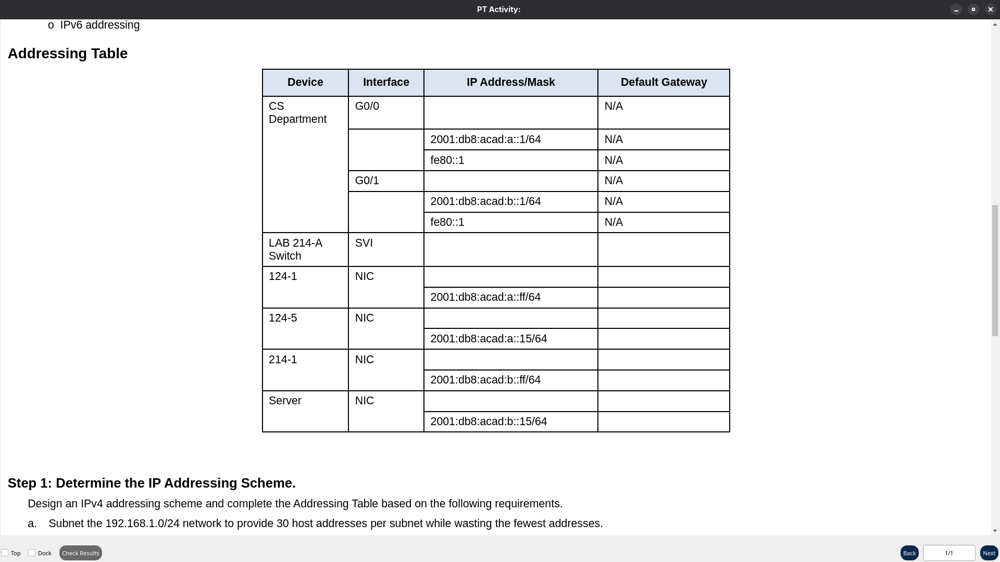
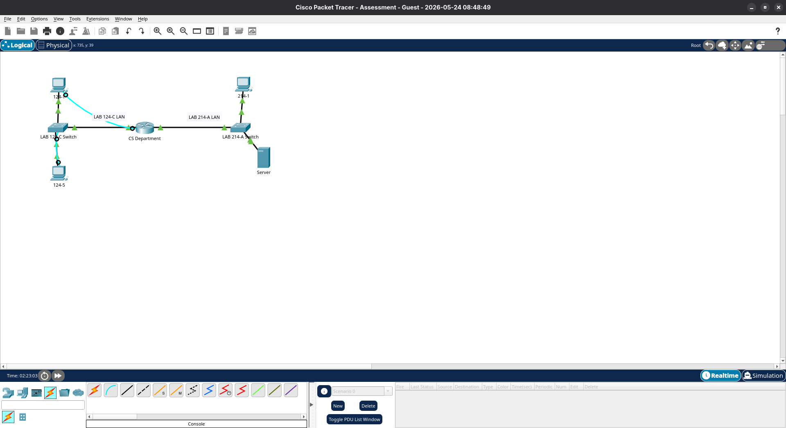
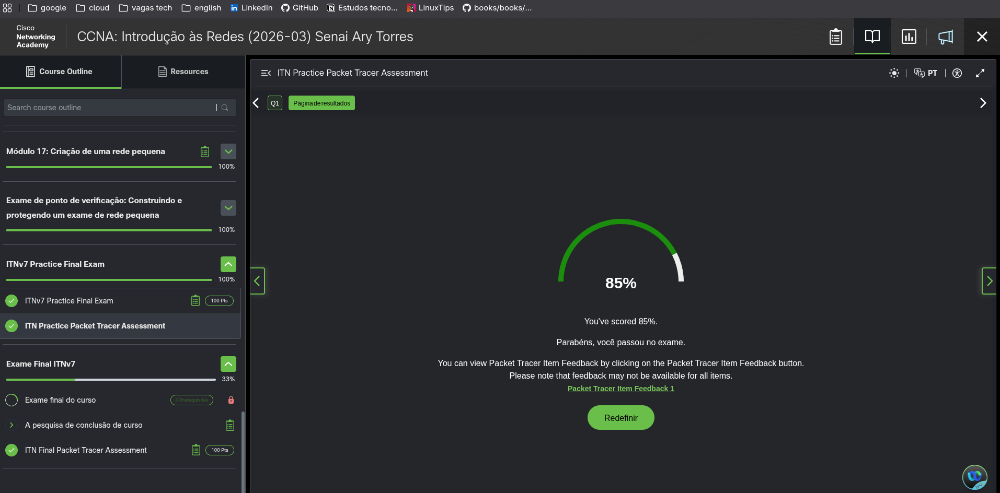

# Resolução de Teste prático - CCNA V7 (Introduction to Networks)


<div align="center">
  
</div>

## 1 - Desafio apresentado

O desafio consistia em configurar a rede de uma empresa dividida em dois blocos de computadores (LANs), garantindo que todos os dispositivos conseguissem se comunicar de forma segura. 

Os principais requisitos do enunciado eram:
* **Divisão de IPs:** Pegar a rede base `192.168.1.0/24` e dividi-la em sub-redes menores para atender as necessidades de cada setor sem desperdiçar endereços.
* **Segurança dos Equipamentos:** Proteger o acesso ao roteador exigindo senhas de no mínimo 10 caracteres, criptografar senhas locais e liberar o acesso remoto apenas via SSH (bloqueando o Telnet).
* **Gerenciamento do Switch:** Ativar o acesso remoto do Switch através da VLAN 1, garantindo que ele possa ser acessado até por computadores de outras redes.
* **Rede Híbrida:** Configurar interfaces e hosts para rodar tanto IPv4 quanto IPv6 juntos.


<div align="center">
  
</div>

---

## 2 - Resolução de Schema de IPs

Para resolver o problema do desperdício de endereços, utilizei a lógica da tabela de 8 bist [ 128, 64, 32, 16, 8, 4, 2, 1] para realizar o cálculo de divisão de sub-redes (VLSM). O enunciado exigia encontrar a 4ª sub-rede com tamanho para 30 hosts e, a partir da 5ª sub-rede, criar um novo bloco menor para 14 hosts.

Precisei calcular em sequência para mapear todo o cenário e atender aos requisitos do exame:

### Sub-redes
* **Sub 1:** `192.168.1.0/27` (Suporta 30 hosts | Broadcast: .31) - *Não utilizada*
* **Sub 2:** `192.168.1.32/27` (Suporta 30 hosts | Broadcast: .63) - *Não utilizada*
* **Sub 3:** `192.168.1.64/27` (Suporta 30 hosts | Broadcast: .95) - *Não utilizada*
* **Sub 4 (Atribuída à LAN 124-C):** `192.168.1.96/27` (Suporta 30 hosts | Broadcast: .127)
  * IPs válidos: `192.168.1.97` a `192.168.1.126`
* **Sub 5 (Nova quebra para 14 hosts /28):** `192.168.1.128/28` (Broadcast: .143) - *Não utilizada*
* **Sub 6 (Atribuída à LAN 214-A):** `192.168.1.144/28` (Suporta 14 hosts | Broadcast: .159)
  * IPs válidos: `192.168.1.145` a `192.168.1.158`

---

### Endereçamento IPs

Com os cálculos feitos , a distribuição dos IPs na interface dos dispositivos ficou assim:

| Dispositivo / Setor | Interface | Endereço IP / Sub-rede | Máscara de Rede | Gateway Padrão |
| :--- | :--- | :--- | :--- | :--- |
| **Roteador (CS-Department)** | G0/0 (LAN 124-C) | 192.168.1.126 | 255.255.255.224 (/27) | N/A |
| **Roteador (CS-Department)** | G0/1 (LAN 214-A) | 192.168.1.158 | 255.255.255.240 (/28) | N/A |
| **Switch (LAB 214-A)** | VLAN 1 (SVI) | 192.168.1.157 | 255.255.255.240 (/28) | 192.168.1.158 |
| **Computadores (LAN 124-C)** | Placa de Rede | 192.168.1.97 a 192.168.1.125 | 255.255.255.224 (/27) | 192.168.1.126 |
| **Computadores (LAN 214-A)** | Placa de Rede | 192.168.1.145 a 192.168.1.156 | 255.255.255.240 (/28) | 192.168.1.158 |

---
## 3. Configuração de Roteador e Switching
Aqui estão os comandos que apliquei via terminal (CLI) para realiza a configuração dos dispositivos e adicionamento das regras de segurança exigidas:

### Configuração do Roteador (CS-Department)
```cisco
   enable
   configure terminal

   ! Definição do Hostname
   hostname CS-Department

   ! Política de segurança de senhas
   security passwords min-length 10

   ! Configuração de senhas globais e criptografia
   enable secret roootadmin
   service password-encryption
   banner motd # ACESSO NAO AUTORIZADO #

   ! Configuração da linha de Console
   line console 0
   password console
   login
   exit

   ! Configuração de domínio e chaves para o SSH
   ip domain-name ccna.com
   crypto key generate rsa
   1024

   ! Usuário administrativo e segurança das linhas VTY (Apenas SSH)
   username netadmin secret Cisco_CCNA7
   line vty 0 4
   transport input ssh
   login local
   xit

   ! Configuração da Interface G0/0 (LAB 124-C)
   interface GigabitEthernet0/0
   description Conexao com a LAN do LAB 124-C
   ip address 192.168.1.126 255.255.255.224
   ipv6 address 2001:db8:acad:a::1/64
   ipv6 address fe80::1 link-local
   no shutdown
   exit

   ! Configuração da Interface G0/1 (LAB 214-A)
   interface GigabitEthernet0/1
   description Conexao com a LAN do LAB 214-A
   ip address 192.168.1.158 255.255.255.240
   ipv6 address 2001:db8:acad:b::1/64
   ipv6 address fe80::1 link-local
   no shutdown
   exit

   end
   copy running-config startup-config

 ```

 ### Configuração do Switch (LAB 214-A)

```cisco 
   enable
   configure terminal

   ! Nome do dispositivo conforme o exame
   hostname LAB-214-A

   ! Senha de modo privilegiado
   enable secret cisco

   ! Configuração da Interface Virtual (SVI) para gerenciamento interno
   interface vlan 1
   ip address 192.168.1.157 255.255.255.240
   no shutdown
   exit

   ! Rota de saída para pacotes de outras redes
   ip default-gateway 192.168.1.158

   ! Ativação do acesso remoto via Telnet básico (solicitado para o Switch)
   line vty 0 15
   password cisco
   login
   exit

   end
   copy running-config startup-config

 ```

## 3. Resultados final do teste prático ( Cisco packet tracer )

Conseguir resolver o schema de Ips conforme requisitos solitados , com comandos configurei e adicionei segurança ao roteador , switching e conectividade com todos os dispositivo na rede LAN.


<div align="center">
  
</div>

<br>

### Faltou implementações e ocorreu alguns erros , mas obtive 85% de aproveitamento no teste.

<br>

<div align="center">
  
</div>


